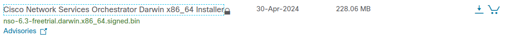

# Cisco Network Service orchestrator

#### Installation on Linux (Tested on Linux Mint 21.2)

Download trial version NSO software from [Cisco&#39;s website](https://software.cisco.com/download/home/286331591/type/286283941/release/6.3). I downloaded below version, It is also available as a docker image if you prefer.



##### Create directory and prepare install -

```
mkdir ~/nso-6.0
sh nso-6.3.linux.x86_64.installer.bin ~/nso-6.0/ --local-install

# Once installed, load environment variables 
cd ~/nso-6.0
source ~/nso-6.0
```

##### Create Install directory and run setup

```
mkdir ~/nso-instance
ncs-setup

(in case you are wondering, ncs is nso's old name)

ncs-setup --package ~/nso-6.0/packages/neds/cisco-iosxr-cli-3.5 --package ~/nso-6.0/packages/neds/cisco-asa-cli-6.6 --package ~/nso-6.0/packages/neds/cisco-ios-cli-3.8 --package ~/nso-6.0/packages/neds/cisco-nx-cli-3.0 --package ~/nso-6.0/packages/neds/cisco-nx-cli-3.0 --dest ~/nso-instance

```

##### Run Cisco NSO

```
ncs

check status
ncs --status | grep status
```

> EACH TIME YOU WANT TO RUN, YOU WILL HAVE TO LOAD ENVIRONMENT VARIABLES ( source ~/nso-6.0/ncsrc)

##### Access Cisco NSO

```
ncs_cli -C -u admin
#(no password required)
```

Also reachable on http://localhost:8080

##### Connect to network devices

```
FROM terminal 

ncs_cli -C -u admin

-> Add authentication group
devices authgroups group CDGROUP
    default-map remote-name admin
    default-map remote-password admin
    default-map remote-secondary-password admin123 (enable password!)

-> Add a device
devices device R1
    address 10.10.10.1
    authgroup CDGROUP
    ssh host-key-verification none
    device-type cli ned-id cisco-ios-cli-3.8
    device-type cli protocol ssh
    state admin-state unlocked
    commit
    connect
    end